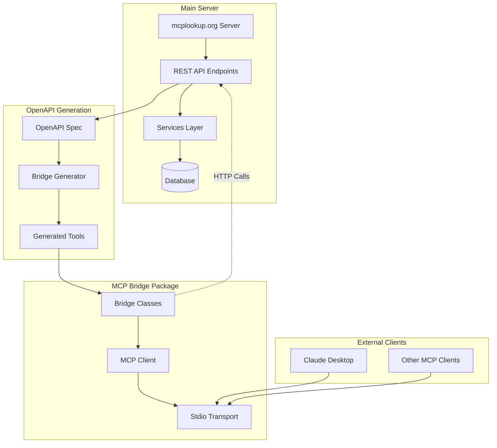
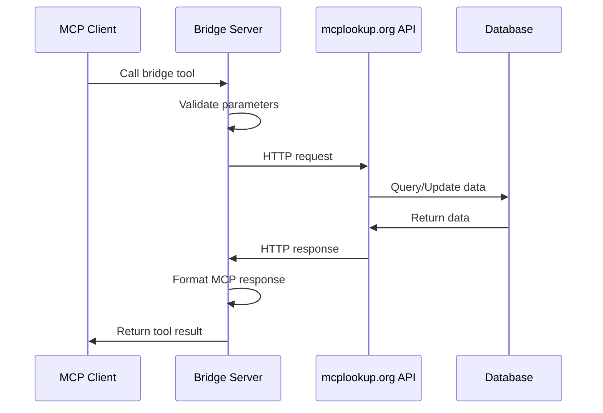
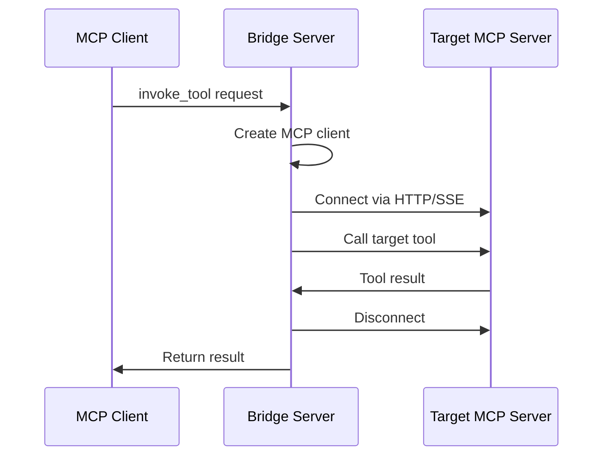
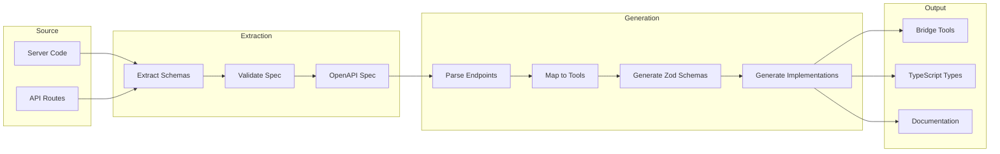
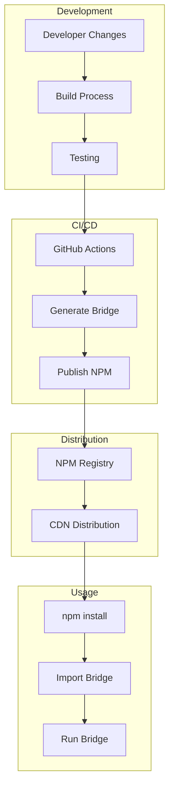
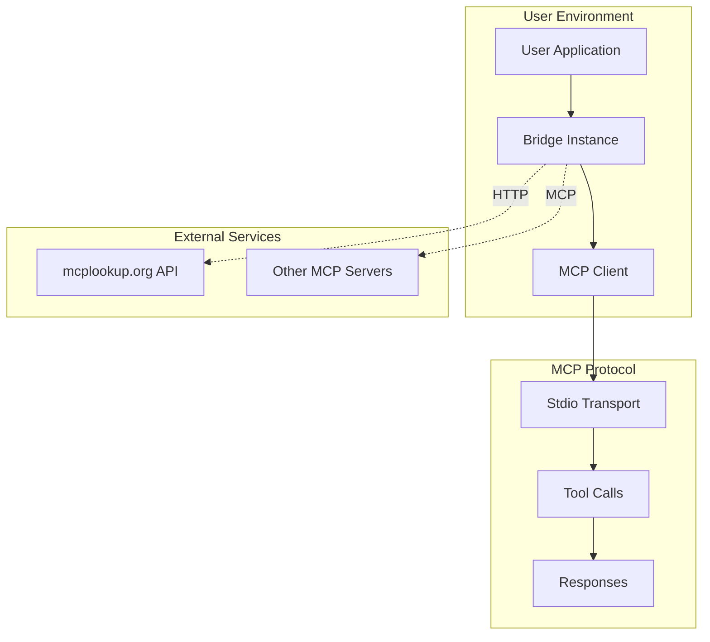

# 🏗️ MCP Bridge Architecture

## System Overview

The MCP Bridge provides **API parity** with the main mcplookup.org server through automated OpenAPI generation and bridge tool synthesis.



## 🔧 Core Components

### **1. OpenAPI Specification**
- **Source**: Generated from main server code
- **Format**: OpenAPI 3.0 JSON/YAML
- **Content**: All REST API endpoints with schemas
- **Updates**: Automatic on API changes

### **2. Bridge Generator**
- **Input**: OpenAPI specification
- **Output**: TypeScript bridge tools
- **Process**: Automated code generation
- **Validation**: Schema and type checking

### **3. Bridge Tools**
- **Count**: 7 main tools + 1 bridge tool
- **Parity**: Identical to main server tools
- **Transport**: HTTP REST API calls
- **Authentication**: API key support

### **4. MCP Server**
- **Protocol**: Model Context Protocol
- **Transport**: Stdio (primary), HTTP (optional)
- **Interface**: Standard MCP tool interface
- **Clients**: Claude Desktop, other MCP clients

## 📋 Tool Architecture

### **Main Server Tools (7)**

#### **Discovery Tools**
```typescript
// discover_mcp_servers
{
  endpoint: 'GET /v1/discover',
  parameters: {
    query?: string,
    domain?: string,
    capability?: string,
    limit?: number
  },
  response: ServerDiscoveryResult[]
}

// browse_capabilities  
{
  endpoint: 'GET /v1/capabilities',
  parameters: {
    category?: string,
    search?: string,
    popular?: boolean
  },
  response: CapabilityInfo[]
}

// list_mcp_tools
{
  endpoint: 'GET /v1/tools',
  parameters: {},
  response: ToolInfo[]
}
```

#### **Registration Tools**
```typescript
// register_mcp_server
{
  endpoint: 'POST /v1/register',
  parameters: {
    domain: string,
    endpoint: string,
    capabilities?: string[],
    category?: string,
    auth_type?: string,
    contact_email?: string,
    description?: string,
    user_id: string
  },
  response: RegistrationResult
}

// verify_domain_ownership
{
  endpoint: 'POST /v1/verify',
  parameters: {
    domain: string,
    challenge_id?: string
  },
  response: VerificationResult
}
```

#### **Monitoring Tools**
```typescript
// get_server_health
{
  endpoint: 'GET /v1/health',
  parameters: {
    domain?: string,
    domains?: string[]
  },
  response: HealthMetrics[]
}

// get_discovery_stats
{
  endpoint: 'GET /v1/stats',
  parameters: {
    timeframe?: 'hour' | 'day' | 'week' | 'month',
    metric?: 'discoveries' | 'registrations' | 'health_checks' | 'popular_domains'
  },
  response: AnalyticsData
}
```

### **Bridge Tool (1)**

#### **Universal MCP Client**
```typescript
// invoke_tool
{
  functionality: 'Call any tool on any streaming HTTP MCP server',
  parameters: {
    endpoint: string,      // Target MCP server URL
    tool_name: string,     // Tool to call
    arguments?: object,    // Tool arguments
    auth_headers?: object  // Authentication headers
  },
  transport: ['StreamableHTTP', 'SSE'],
  response: ToolResult
}
```

## 🔄 Data Flow

### **1. Bridge Tool Execution**



### **2. Universal Tool Invocation**



## 🏛️ Class Architecture

### **Core Classes**

```typescript
// Main bridge implementation
class BridgeToolsWithAPIParity {
  private server: McpServer;
  private apiBaseUrl: string;
  private apiKey?: string;
  
  constructor(server, apiBaseUrl, apiKey?)
  private setupBridgeTools(): void
  private makeApiRequest(path, method, params): Promise<any>
}

// Integration helper
class IntegratedBridge {
  private server: McpServer;
  private bridgeTools: BridgeToolsWithAPIParity;
  
  constructor(server, apiKey?)
  getAvailableTools(): ToolMetadata[]
  getToolsByCategory(category): string[]
  hasToolAvailable(toolName): boolean
}

// Main bridge classes
class MCPHttpBridge {
  private server: McpServer;
  private integratedBridge: IntegratedBridge;
  
  constructor(httpEndpoint?, authHeaders?)
  async run(): Promise<void>
  async close(): Promise<void>
}

class EnhancedMCPBridge extends MCPHttpBridge {
  getAvailableTools(): ToolMetadata[]
  getToolsByCategory(category): string[]
  hasToolAvailable(toolName): boolean
  getToolMetadata(toolName): ToolMetadata
}
```

### **Type Definitions**

```typescript
interface ToolMetadata {
  name: string;
  description: string;
  category: string;
  source: 'bridge';
}

interface BridgeConfig {
  apiBaseUrl?: string;
  apiKey?: string;
  httpEndpoint?: string;
  authHeaders?: Record<string, string>;
}

interface InvokeToolArgs {
  endpoint: string;
  tool_name: string;
  arguments?: Record<string, any>;
  auth_headers?: Record<string, string>;
}
```

## 🔧 Generation Architecture

### **OpenAPI to Bridge Pipeline**



### **Tool Generation Logic**

```typescript
interface ToolGenerator {
  // Extract endpoint information
  extractEndpoints(spec: OpenAPIV3.Document): EndpointInfo[];
  
  // Generate tool names
  generateToolName(endpoint: EndpointInfo): string;
  
  // Convert OpenAPI parameters to Zod schemas
  generateZodSchema(parameters: ParameterInfo[]): ZodSchema;
  
  // Generate tool implementation
  generateImplementation(endpoint: EndpointInfo): string;
  
  // Render complete bridge file
  renderBridgeFile(tools: ToolInfo[]): string;
}
```

## 🚀 Deployment Architecture

### **Package Distribution**



### **Runtime Architecture**



## 🎯 Design Principles

### **API Parity**
- Bridge tools provide identical functionality to main server
- Same tool names, parameters, and response formats
- Transparent switching between direct and API access

### **Automatic Sync**
- Bridge tools automatically updated when API changes
- No manual maintenance required
- Single source of truth (OpenAPI spec)

### **Type Safety**
- Generated TypeScript interfaces
- Compile-time validation
- Runtime schema validation with Zod

### **Universal Connectivity**
- Bridge can connect to any MCP server
- Support for multiple transport protocols
- Flexible authentication mechanisms

### **Developer Experience**
- Simple installation and usage
- Clear documentation and examples
- Comprehensive error handling

---

**This architecture ensures robust, maintainable, and scalable bridge functionality with perfect API parity!** 🚀
