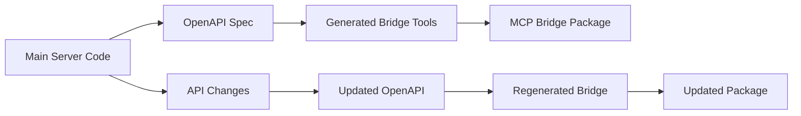

# 🔧 OpenAPI Generation for MCP Bridge

## Overview

The MCP Bridge uses **OpenAPI specification** to automatically generate API client code that provides parity with the main mcplookup.org server. This ensures the bridge tools have identical functionality to the main server but call REST APIs instead of services directly.

## 🎯 Why OpenAPI Generation?

### **API Parity**
- **Main Server**: Direct service calls, database access
- **Bridge**: REST API calls with identical functionality
- **Same Tools**: Identical names, schemas, parameters, responses

### **Automatic Sync**
- API changes automatically update bridge tools
- No manual maintenance of bridge code
- Single source of truth (OpenAPI spec)

### **Type Safety**
- Generated TypeScript interfaces
- Compile-time validation
- Runtime schema validation with Zod

## 📋 Generation Process

### 1. **Extract OpenAPI Spec from Main Server**

The main mcplookup.org server exposes its API via OpenAPI specification:

```bash
# Generate OpenAPI spec from the main server
curl https://mcplookup.org/api/openapi.json > openapi.json

# Or generate from source code
npm run openapi:generate
```

### 2. **Generate Bridge Tools from OpenAPI**

Use the OpenAPI spec to generate bridge tools:

```typescript
// scripts/generate-bridge-from-openapi.ts
import { generateBridgeTools } from './openapi-bridge-generator';

async function generateBridge() {
  const spec = await loadOpenAPISpec('./openapi.json');
  const bridgeTools = generateBridgeTools(spec);
  await writeBridgeFile('./src/bridge-tools.ts', bridgeTools);
}
```

### 3. **Bridge Tool Generation Logic**

Each OpenAPI endpoint becomes a bridge tool:

```typescript
// OpenAPI endpoint
{
  "paths": {
    "/v1/discover": {
      "get": {
        "operationId": "discoverServers",
        "parameters": [...],
        "responses": {...}
      }
    }
  }
}

// Generated bridge tool
this.server.tool(
  'discover_mcp_servers',
  'Flexible MCP server discovery...',
  {
    query: z.string().optional().describe('Natural language query'),
    domain: z.string().optional().describe('Exact domain lookup'),
    // ... other parameters from OpenAPI spec
  },
  async (args) => {
    const result = await this.makeApiRequest('/v1/discover', 'GET', args);
    return {
      content: [{
        type: 'text',
        text: JSON.stringify(result, null, 2)
      }]
    };
  }
);
```

## 🔄 Bidirectional Sync Workflow

### **Code → OpenAPI → Bridge**



### **Automatic Updates**

1. **Developer changes API** in main server
2. **OpenAPI spec regenerated** from code
3. **Bridge tools regenerated** from OpenAPI
4. **Package updated** with new tools
5. **Users get updates** via npm

## 🛠️ Implementation Details

### **OpenAPI to Zod Schema Conversion**

```typescript
// OpenAPI parameter
{
  "name": "query",
  "in": "query",
  "schema": {
    "type": "string",
    "description": "Natural language search query"
  },
  "required": false
}

// Generated Zod schema
query: z.string().optional().describe('Natural language search query')
```

### **HTTP Method Mapping**

```typescript
const methodMapping = {
  'GET': 'GET',
  'POST': 'POST', 
  'PUT': 'PUT',
  'DELETE': 'DELETE',
  'PATCH': 'PATCH'
};

// Generate API call
const result = await this.makeApiRequest(
  endpoint.path,
  endpoint.method,
  args
);
```

### **Response Formatting**

```typescript
// All bridge tools return consistent MCP format
return {
  content: [{
    type: 'text',
    text: JSON.stringify(result, null, 2)
  }],
  isError: false
};
```

## 📝 Tool Naming Convention

### **OpenAPI → Bridge Tool Names**

```typescript
const toolNameMapping = {
  // Discovery endpoints
  'GET /v1/discover': 'discover_mcp_servers',
  'POST /v1/discover/smart': 'smart_discover_servers',
  
  // Registration endpoints  
  'POST /v1/register': 'register_mcp_server',
  'GET /v1/register/verify/{id}': 'verify_domain_ownership',
  
  // Health endpoints
  'GET /v1/health/{domain}': 'get_server_health',
  
  // Management endpoints
  'GET /v1/my/servers': 'get_my_servers',
  'PUT /v1/servers/{domain}': 'update_server',
  'DELETE /v1/servers/{domain}': 'delete_server',
  
  // Utility endpoints
  'GET /v1/tools': 'list_mcp_tools',
  'GET /v1/capabilities': 'browse_capabilities',
  'GET /v1/stats': 'get_discovery_stats'
};
```

## 🔧 Generation Scripts

### **Main Generation Script**

```typescript
// scripts/generate-bridge.ts
import { OpenAPIV3 } from 'openapi-types';
import { generateZodSchema } from './zod-generator';
import { generateToolImplementation } from './tool-generator';

export async function generateBridgeFromOpenAPI(
  specPath: string,
  outputPath: string
) {
  // 1. Load OpenAPI spec
  const spec: OpenAPIV3.Document = await loadSpec(specPath);
  
  // 2. Extract endpoints
  const endpoints = extractEndpoints(spec);
  
  // 3. Generate tools
  const tools = endpoints.map(endpoint => ({
    name: generateToolName(endpoint),
    description: endpoint.description,
    schema: generateZodSchema(endpoint.parameters),
    implementation: generateToolImplementation(endpoint)
  }));
  
  // 4. Generate bridge file
  const bridgeCode = generateBridgeFile(tools);
  
  // 5. Write to file
  await writeFile(outputPath, bridgeCode);
}
```

### **Schema Generation**

```typescript
// scripts/zod-generator.ts
export function generateZodSchema(parameters: OpenAPIV3.ParameterObject[]) {
  const schema = {};
  
  for (const param of parameters) {
    const zodType = convertOpenAPITypeToZod(param.schema);
    const description = param.description;
    const required = param.required;
    
    schema[param.name] = required 
      ? zodType.describe(description)
      : zodType.optional().describe(description);
  }
  
  return schema;
}

function convertOpenAPITypeToZod(schema: OpenAPIV3.SchemaObject) {
  switch (schema.type) {
    case 'string': return 'z.string()';
    case 'number': return 'z.number()';
    case 'integer': return 'z.number()';
    case 'boolean': return 'z.boolean()';
    case 'array': return `z.array(${convertOpenAPITypeToZod(schema.items)})`;
    case 'object': return 'z.record(z.any())';
    default: return 'z.any()';
  }
}
```

## 🚀 Automation Setup

### **GitHub Actions Workflow**

```yaml
# .github/workflows/sync-bridge.yml
name: Sync Bridge with API

on:
  push:
    paths:
      - 'src/app/api/**'
      - 'openapi.yaml'

jobs:
  sync-bridge:
    runs-on: ubuntu-latest
    steps:
      - uses: actions/checkout@v4
      
      - name: Generate OpenAPI Spec
        run: npm run openapi:generate
        
      - name: Generate Bridge Tools
        run: npm run bridge:generate
        
      - name: Update Bridge Package
        run: |
          cd mcp-bridge
          npm version patch
          npm run build
          npm publish
        env:
          NPM_TOKEN: ${{ secrets.NPM_TOKEN }}
```

### **Package.json Scripts**

```json
{
  "scripts": {
    "openapi:generate": "tsx scripts/generate-openapi.ts",
    "bridge:generate": "tsx scripts/generate-bridge.ts",
    "bridge:sync": "npm run openapi:generate && npm run bridge:generate",
    "bridge:publish": "cd mcp-bridge && npm run build && npm publish"
  }
}
```

## 📊 Benefits of OpenAPI Generation

### **✅ Consistency**
- Bridge tools always match main server API
- No drift between server and bridge
- Identical parameter validation

### **✅ Maintainability** 
- No manual bridge code maintenance
- Automatic updates when API changes
- Single source of truth

### **✅ Type Safety**
- Generated TypeScript interfaces
- Compile-time validation
- Runtime schema validation

### **✅ Documentation**
- Bridge tools automatically documented
- Parameter descriptions from OpenAPI
- Usage examples generated

## 🔄 Update Process

### **When API Changes**

1. **Developer updates main server API**
2. **OpenAPI spec regenerated** (manual or automatic)
3. **Bridge tools regenerated** from new spec
4. **Bridge package updated** and published
5. **Users update** via `npm update @mcplookup-org/mcp-bridge`

### **Version Management**

```bash
# Semantic versioning based on API changes
# Patch: Bug fixes, no API changes
# Minor: New endpoints, backward compatible
# Major: Breaking API changes

npm version patch  # 1.0.0 → 1.0.1
npm version minor  # 1.0.1 → 1.1.0  
npm version major  # 1.1.0 → 2.0.0
```

## 🎯 Best Practices

### **OpenAPI Spec Quality**
- Complete parameter descriptions
- Proper response schemas
- Consistent naming conventions
- Comprehensive examples

### **Bridge Generation**
- Validate generated code
- Test bridge tools
- Maintain backward compatibility
- Document breaking changes

### **Package Management**
- Semantic versioning
- Changelog maintenance
- Deprecation notices
- Migration guides

---

**This OpenAPI generation approach ensures the MCP Bridge always has perfect API parity with the main server!** 🚀
