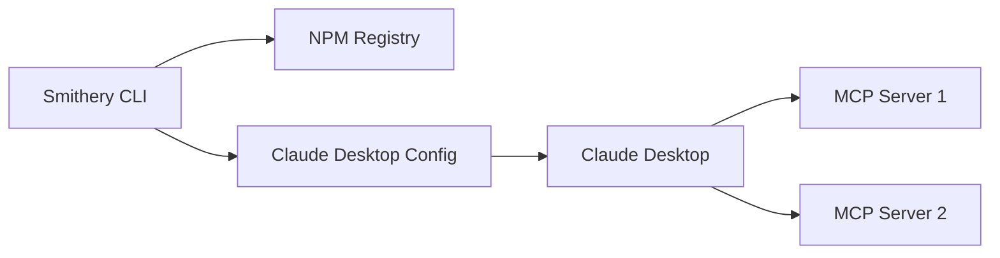
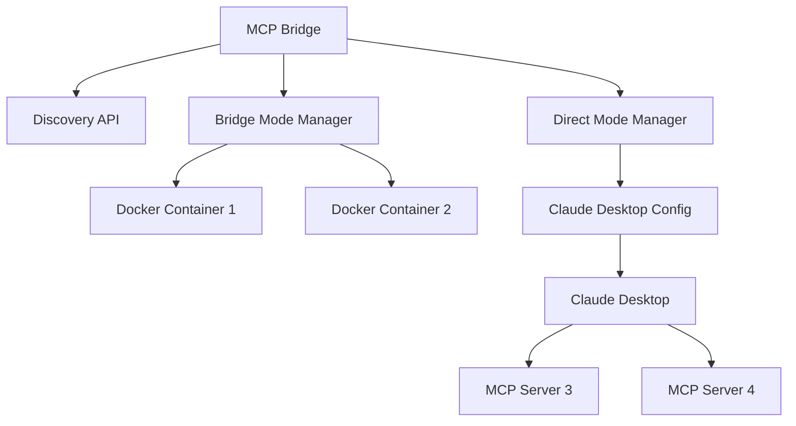

# ⚖️ MCP Bridge vs Smithery

This document provides a comprehensive comparison between the MCP Bridge and Smithery, helping you understand when to use each tool and how they complement each other.

## 🎯 Overview

| Aspect | MCP Bridge | Smithery |
|--------|------------|----------|
| **Primary Focus** | Universal MCP management platform | MCP server package manager |
| **Installation Modes** | Bridge (dynamic) + Direct (static) | Static configuration only |
| **Tool Delegation** | Yes (bridge mode) | No |
| **Runtime Management** | Yes | No |
| **Discovery** | Built-in server discovery | Package registry |
| **Configuration** | Hybrid approach | Claude Desktop config only |

## 🏗️ Architecture Comparison

### **Smithery Architecture**



**Characteristics:**
- CLI-based package manager
- Direct config modification
- Static installation only
- No runtime management

### **MCP Bridge Architecture**



**Characteristics:**
- Universal management platform
- Hybrid installation modes
- Runtime server management
- Built-in discovery and invocation

## 📊 Feature Comparison

### **Installation & Management**

| Feature | Smithery | MCP Bridge |
|---------|----------|------------|
| **Package Installation** | ✅ NPM packages | ✅ NPM packages + Docker |
| **Static Config** | ✅ Claude Desktop config | ✅ Direct mode |
| **Dynamic Installation** | ❌ No | ✅ Bridge mode |
| **Runtime Control** | ❌ No | ✅ Start/stop/restart |
| **Temporary Installation** | ❌ No | ✅ Bridge mode |
| **Docker Support** | ❌ No | ✅ Native support |
| **Environment Variables** | ✅ Via config | ✅ Both modes |

### **User Experience**

| Aspect | Smithery | MCP Bridge |
|--------|----------|------------|
| **Learning Curve** | Low | Medium |
| **Installation Speed** | Medium (restart required) | Instant (bridge mode) |
| **Tool Names** | Native | Native (direct) / Prefixed (bridge) |
| **Configuration** | Simple | Flexible |
| **Debugging** | Limited | Comprehensive |

### **Performance**

| Metric | Smithery | MCP Bridge Direct | MCP Bridge Bridge |
|--------|----------|-------------------|-------------------|
| **Tool Call Latency** | Native | Native | +5-10ms |
| **Memory Usage** | Low | Low | Medium |
| **Startup Time** | Restart required | Restart required | Instant |
| **Resource Overhead** | None | None | Docker containers |

## 🔄 Workflow Comparison

### **Smithery Workflow**

```bash
# 1. Install via CLI
npx -y @smithery/cli install @company/mcp-server --client claude

# 2. Restart Claude Desktop (required)

# 3. Use tools directly
send_email({"to": "user@example.com"})  # Native tool name

# 4. Remove via CLI
npx -y @smithery/cli remove @company/mcp-server --client claude

# 5. Restart Claude Desktop again
```

### **MCP Bridge Workflow**

#### **Bridge Mode (Dynamic)**
```javascript
// 1. Install instantly
await callTool('install_mcp_server', {
  name: 'email',
  type: 'npm',
  command: '@company/mcp-server',
  mode: 'bridge'
});

// 2. Use immediately (no restart)
await callTool('email_send_email', {
  to: 'user@example.com'
});

// 3. Remove instantly
await callTool('control_mcp_server', {
  name: 'email',
  action: 'remove'
});
```

#### **Direct Mode (Smithery-compatible)**
```javascript
// 1. Install via bridge
await callTool('install_mcp_server', {
  name: 'email',
  type: 'npm',
  command: '@company/mcp-server',
  mode: 'direct'
});

// 2. Restart Claude Desktop (required)

// 3. Use with native names
await callTool('send_email', {
  to: 'user@example.com'
});

// 4. Remove via bridge
await callTool('remove_claude_server', {
  name: 'email'
});
```

## 🎯 Use Case Comparison

### **When to Use Smithery**

#### **✅ Ideal For:**
- **Simple package management** needs
- **Permanent installations** only
- **Minimal learning curve** required
- **Direct Claude Desktop integration**
- **Existing Smithery workflows**

#### **Example Scenarios:**
```bash
# Install a well-known, stable server
npx -y @smithery/cli install @modelcontextprotocol/server-filesystem --client claude

# Team standardization with known packages
npx -y @smithery/cli install @company/standard-server --client claude
```

### **When to Use MCP Bridge**

#### **✅ Ideal For:**
- **Development and testing** workflows
- **Dynamic server management** needs
- **Docker-based servers**
- **Server discovery** requirements
- **Hybrid installation** approaches
- **Runtime server control**

#### **Example Scenarios:**
```javascript
// Test multiple email servers
await callTool('install_mcp_server', {
  name: 'gmail-test',
  type: 'docker',
  command: 'docker run -i gmail-server:latest',
  mode: 'bridge'
});

// Production deployment with discovery
const servers = await callTool('discover_mcp_servers', {
  query: 'production email servers'
});

await callTool('install_mcp_server', {
  name: 'production-email',
  type: 'npm',
  command: servers[0].npm_package,
  mode: 'direct'
});
```

## 🔄 Migration Strategies

### **Smithery → MCP Bridge**

#### **1. Inventory Existing Installations**

```bash
# Check current Claude Desktop config
cat ~/Library/Application\ Support/Claude/claude_desktop_config.json
```

#### **2. Migrate to Bridge Management**

```javascript
// For each Smithery-installed server:

// Remove from Smithery (optional)
// npx -y @smithery/cli remove @company/server --client claude

// Install via bridge direct mode
await callTool('install_mcp_server', {
  name: 'migrated-server',
  type: 'npm',
  command: '@company/server',
  mode: 'direct'
});
```

#### **3. Gradual Migration**

```javascript
// Keep stable servers in direct mode
await callTool('install_mcp_server', {
  name: 'stable-filesystem',
  type: 'npm',
  command: '@modelcontextprotocol/server-filesystem',
  mode: 'direct'
});

// Use bridge mode for new/experimental servers
await callTool('install_mcp_server', {
  name: 'experimental-api',
  type: 'docker',
  command: 'docker run -i experimental/api:latest',
  mode: 'bridge'
});
```

### **MCP Bridge → Smithery**

If you prefer Smithery's simplicity:

```bash
# 1. Remove from bridge
await callTool('remove_claude_server', {
  name: 'server-name'
});

# 2. Install via Smithery
npx -y @smithery/cli install @company/server --client claude

# 3. Restart Claude Desktop
```

## 🤝 Complementary Usage

### **Hybrid Approach (Recommended)**

Use both tools for their strengths:

#### **Smithery for Stable Servers**
```bash
# Core, stable servers via Smithery
npx -y @smithery/cli install @modelcontextprotocol/server-filesystem --client claude
npx -y @smithery/cli install @company/production-email --client claude
```

#### **MCP Bridge for Dynamic Needs**
```javascript
// Development and testing via bridge
await callTool('install_mcp_server', {
  name: 'dev-api',
  type: 'docker',
  command: 'docker run -i dev/api:latest',
  mode: 'bridge'
});

// Discovery and experimentation
const newServers = await callTool('discover_mcp_servers', {
  query: 'new productivity tools'
});
```

## 📊 Decision Matrix

| Requirement | Smithery | MCP Bridge Direct | MCP Bridge Bridge |
|-------------|----------|-------------------|-------------------|
| **Permanent installation** | ✅ | ✅ | ❌ |
| **Instant testing** | ❌ | ❌ | ✅ |
| **Native tool names** | ✅ | ✅ | ❌ |
| **Docker support** | ❌ | ✅ | ✅ |
| **Runtime control** | ❌ | ❌ | ✅ |
| **Server discovery** | ❌ | ✅ | ✅ |
| **Simple CLI** | ✅ | ❌ | ❌ |
| **No restart needed** | ❌ | ❌ | ✅ |
| **Isolation** | ❌ | ❌ | ✅ |

## 🔧 Technical Differences

### **Configuration Format**

Both tools create the same Claude Desktop config format:

```json
{
  "mcpServers": {
    "server-name": {
      "command": "npx",
      "args": ["@company/server"],
      "env": {
        "API_KEY": "value"
      }
    }
  }
}
```

### **Package Sources**

| Tool | NPM Packages | Docker Images | Custom Commands |
|------|--------------|---------------|-----------------|
| **Smithery** | ✅ | ❌ | ❌ |
| **MCP Bridge** | ✅ | ✅ | ✅ |

### **Error Handling**

| Aspect | Smithery | MCP Bridge |
|--------|----------|------------|
| **Installation Errors** | CLI output | Structured responses |
| **Runtime Errors** | Claude Desktop logs | Bridge logs + server logs |
| **Debugging** | Manual | Built-in tools |

## 🚀 Performance Benchmarks

### **Installation Speed**

| Operation | Smithery | MCP Bridge Direct | MCP Bridge Bridge |
|-----------|----------|-------------------|-------------------|
| **Install** | 10-30s + restart | 5-15s + restart | 5-15s |
| **Remove** | 5s + restart | 2s + restart | 1s |
| **Total Time** | 60-90s | 60-75s | 5-15s |

### **Tool Call Performance**

| Mode | Latency | Throughput |
|------|---------|------------|
| **Smithery** | ~50ms | High |
| **Bridge Direct** | ~50ms | High |
| **Bridge Bridge** | ~55-60ms | Medium-High |

## 🎯 Recommendations

### **For Beginners**
- **Start with Smithery** for simplicity
- **Learn MCP Bridge** for advanced features

### **For Developers**
- **Use MCP Bridge bridge mode** for development
- **Use direct mode or Smithery** for production

### **For Teams**
- **Smithery** for standardized team setups
- **MCP Bridge** for flexible development environments

### **For Production**
- **Either tool** works well for static deployments
- **MCP Bridge** offers more monitoring and control

## 🔮 Future Considerations

### **Smithery Roadmap**
- Focus on package management simplicity
- Enhanced registry features
- Better error handling

### **MCP Bridge Roadmap**
- Advanced server orchestration
- Performance optimizations
- Enhanced monitoring and observability
- Smithery CLI compatibility mode

## 📝 Summary

| Aspect | Winner |
|--------|--------|
| **Simplicity** | Smithery |
| **Flexibility** | MCP Bridge |
| **Performance** | Tie (direct modes) |
| **Development** | MCP Bridge |
| **Production** | Tie |
| **Innovation** | MCP Bridge |

**Bottom Line:** Both tools are excellent and serve different needs. Many users benefit from using both - Smithery for simple, permanent installations and MCP Bridge for dynamic development and advanced server management.

---

**Next Steps:**
- [🔧 Installation Guide](../installation.md)
- [🎓 First Server Tutorial](../tutorials/first-server.md)
- [🔄 Hybrid Workflows](../guides/hybrid-workflows.md)
