# 🔧 Bridge Mode Guide

Bridge mode provides **dynamic runtime management** of MCP servers, offering instant installation, Docker isolation, and complete lifecycle control. This guide covers everything you need to know about using bridge mode effectively.

## 🎯 What is Bridge Mode?

Bridge mode is a **dynamic server management approach** where the MCP Bridge acts as a proxy and manager for MCP servers. Servers run in isolated Docker containers and their tools are automatically exposed through the bridge with prefixed names.

### **Key Characteristics**

- ✅ **Instant Installation**: No restart required
- ✅ **Docker Isolation**: Each server runs in its own container
- ✅ **Tool Delegation**: Server tools become bridge tools automatically
- ✅ **Runtime Control**: Start, stop, restart servers on demand
- ✅ **Perfect for Testing**: Temporary, non-permanent installations

## 🚀 Getting Started

### **Basic Installation**

```javascript
// Install a Docker-based server
await callTool('install_mcp_server', {
  name: 'gmail',
  type: 'docker',
  command: 'docker run -i mcplookup/gmail-server:latest',
  mode: 'bridge'  // This is the default
});

// Tools are immediately available:
// - gmail_send_email
// - gmail_read_inbox
// - gmail_search_emails
```

### **NPM Package Installation**

```javascript
// Install an NPM package (automatically dockerized)
await callTool('install_mcp_server', {
  name: 'filesystem',
  type: 'npm',
  command: '@modelcontextprotocol/server-filesystem',
  mode: 'bridge'
});

// Tools available immediately:
// - filesystem_read_file
// - filesystem_write_file
// - filesystem_list_directory
```

## 🏗️ How Bridge Mode Works

### **Architecture Overview**


### **Installation Process**

1. **Command Processing**: Bridge parses installation command
2. **Container Setup**: Creates Docker container for the server
3. **Server Connection**: Establishes MCP connection via stdio
4. **Tool Discovery**: Queries server for available tools
5. **Tool Registration**: Registers tools with prefixed names
6. **Ready**: Tools immediately available for use

### **Tool Delegation Flow**

```mermaid
sequenceDiagram
    participant C as Claude Desktop
    participant B as MCP Bridge
    participant S as MCP Server
    
    C->>B: gmail_send_email({to: "user@example.com"})
    B->>B: Parse tool name (gmail_send_email → send_email)
    B->>S: send_email({to: "user@example.com"})
    S->>S: Execute email sending
    S->>B: Return result
    B->>C: Return result
```



## 🔧 Server Management

### **Installation Options**

#### **Auto-start (Default)**

```javascript
await callTool('install_mcp_server', {
  name: 'server-name',
  type: 'docker',
  command: 'docker run -i server:latest',
  auto_start: true  // Default: true
});
// Server starts immediately
```

#### **Manual Start**

```javascript
await callTool('install_mcp_server', {
  name: 'server-name',
  type: 'docker',
  command: 'docker run -i server:latest',
  auto_start: false
});

// Start manually later
await callTool('control_mcp_server', {
  name: 'server-name',
  action: 'start'
});
```

### **Environment Variables**

```javascript
await callTool('install_mcp_server', {
  name: 'api-server',
  type: 'docker',
  command: 'docker run -i api-server:latest',
  env: {
    'API_KEY': 'your-secret-key',
    'DEBUG': 'true',
    'TIMEOUT': '30000'
  }
});
```

### **Lifecycle Management**

#### **Check Server Status**

```javascript
await callTool('list_managed_servers');

// Response shows all servers with status
[
  {
    name: 'gmail',
    type: 'docker',
    status: 'running',
    tools: ['send_email', 'read_inbox'],
    endpoint: undefined
  }
]
```

#### **Control Server Lifecycle**

```javascript
// Stop a server
await callTool('control_mcp_server', {
  name: 'gmail',
  action: 'stop'
});

// Start a server
await callTool('control_mcp_server', {
  name: 'gmail',
  action: 'start'
});

// Restart a server
await callTool('control_mcp_server', {
  name: 'gmail',
  action: 'restart'
});

// Remove a server completely
await callTool('control_mcp_server', {
  name: 'gmail',
  action: 'remove'
});
```

## 🛠️ Tool Usage

### **Tool Naming Convention**

Bridge mode uses **prefixed tool names** to avoid conflicts:

| Server | Original Tool | Bridge Tool |
|--------|---------------|-------------|
| gmail | send_email | gmail_send_email |
| filesystem | read_file | filesystem_read_file |
| custom | process_data | custom_process_data |

### **Using Bridge Tools**

```javascript
// Gmail server tools
await callTool('gmail_send_email', {
  to: 'user@example.com',
  subject: 'Hello from Bridge Mode!',
  body: 'This email was sent via a bridge-managed server.'
});

await callTool('gmail_read_inbox', {
  limit: 10,
  unread_only: true
});

// Filesystem server tools
await callTool('filesystem_read_file', {
  path: '/documents/report.txt'
});

await callTool('filesystem_write_file', {
  path: '/documents/output.txt',
  content: 'Generated by MCP Bridge'
});
```

### **Tool Discovery**

```javascript
// List all available tools (including bridge tools)
await callTool('list_tools');

// Check specific server tools
await callTool('list_managed_servers');
// Look at the 'tools' array for each server
```

## 🔒 Security & Isolation

### **Docker Isolation Benefits**

1. **Process Isolation**: Servers can't access host processes
2. **Filesystem Isolation**: Limited filesystem access via volumes
3. **Network Isolation**: Controlled network access
4. **Resource Limits**: CPU and memory constraints
5. **Clean Removal**: Complete cleanup when removed

### **Security Best Practices**

#### **Environment Variables**

```javascript
// ✅ Good: Use environment variables for secrets
await callTool('install_mcp_server', {
  name: 'secure-server',
  type: 'docker',
  command: 'docker run -i secure-server:latest',
  env: {
    'API_KEY': process.env.SECURE_API_KEY,  // From environment
    'DATABASE_URL': process.env.DB_URL
  }
});

// ❌ Bad: Hardcode secrets in commands
await callTool('install_mcp_server', {
  name: 'insecure-server',
  type: 'docker',
  command: 'docker run -i -e API_KEY=hardcoded-secret server:latest'
});
```

#### **Resource Limits**

```javascript
// Use Docker resource limits in commands
await callTool('install_mcp_server', {
  name: 'limited-server',
  type: 'docker',
  command: 'docker run -i --memory=512m --cpus=0.5 server:latest'
});
```

#### **Network Security**

```javascript
// Restrict network access
await callTool('install_mcp_server', {
  name: 'isolated-server',
  type: 'docker',
  command: 'docker run -i --network=none server:latest'
});
```

## 🎯 Use Cases

### **1. Development & Testing**

```javascript
// Install development version
await callTool('install_mcp_server', {
  name: 'dev-server',
  type: 'docker',
  command: 'docker run -i mycompany/server:dev',
  env: {
    'ENVIRONMENT': 'development',
    'DEBUG': 'true'
  }
});

// Test the server
await callTool('dev-server_test_function', {
  test_data: 'sample'
});

// Remove when done testing
await callTool('control_mcp_server', {
  name: 'dev-server',
  action: 'remove'
});
```

### **2. Experimentation**

```javascript
// Try multiple servers for comparison
const servers = [
  'email-server-a:latest',
  'email-server-b:latest',
  'email-server-c:latest'
];

for (const [index, server] of servers.entries()) {
  await callTool('install_mcp_server', {
    name: `email-test-${index}`,
    type: 'docker',
    command: `docker run -i ${server}`
  });
}

// Test each server
await callTool('email-test-0_send_email', {...});
await callTool('email-test-1_send_email', {...});
await callTool('email-test-2_send_email', {...});

// Keep the best one, remove others
await callTool('control_mcp_server', {
  name: 'email-test-1',
  action: 'remove'
});
```

### **3. Temporary Workflows**

```javascript
// Install server for specific task
await callTool('install_mcp_server', {
  name: 'data-processor',
  type: 'docker',
  command: 'docker run -i data-processing:latest'
});

// Process data
await callTool('data-processor_transform_data', {
  input: 'large-dataset.csv',
  output: 'processed-data.json'
});

// Clean up after task
await callTool('control_mcp_server', {
  name: 'data-processor',
  action: 'remove'
});
```

### **4. Multi-Environment Testing**

```javascript
// Test server with different configurations
const configs = [
  { name: 'prod-config', env: { 'MODE': 'production' } },
  { name: 'staging-config', env: { 'MODE': 'staging' } },
  { name: 'dev-config', env: { 'MODE': 'development' } }
];

for (const config of configs) {
  await callTool('install_mcp_server', {
    name: `server-${config.name}`,
    type: 'docker',
    command: 'docker run -i configurable-server:latest',
    env: config.env
  });
}
```

## 🚀 Performance Optimization

### **Resource Management**

```javascript
// Monitor server resource usage
await callTool('list_managed_servers');

// Remove unused servers
await callTool('control_mcp_server', {
  name: 'unused-server',
  action: 'remove'
});

// Restart servers if needed
await callTool('control_mcp_server', {
  name: 'heavy-server',
  action: 'restart'
});
```

### **Efficient Tool Usage**

```javascript
// ✅ Good: Batch operations when possible
const files = ['file1.txt', 'file2.txt', 'file3.txt'];
for (const file of files) {
  await callTool('filesystem_read_file', { path: file });
}

// ✅ Better: Use server-specific batch operations if available
await callTool('filesystem_read_multiple_files', {
  paths: files
});
```

## 🔄 Migration Strategies

### **Bridge → Direct Mode Migration**

```javascript
// 1. Test in bridge mode
await callTool('install_mcp_server', {
  name: 'test-server',
  type: 'npm',
  command: '@company/server',
  mode: 'bridge'
});

// 2. Test thoroughly
await callTool('test-server_function', {...});

// 3. If satisfied, remove from bridge
await callTool('control_mcp_server', {
  name: 'test-server',
  action: 'remove'
});

// 4. Install in direct mode
await callTool('install_mcp_server', {
  name: 'production-server',
  type: 'npm',
  command: '@company/server',
  mode: 'direct'
});
```

## 🚨 Troubleshooting

### **Common Issues**

#### **Server Won't Start**

```javascript
// Check server status
await callTool('list_managed_servers');

// Try restarting
await callTool('control_mcp_server', {
  name: 'problematic-server',
  action: 'restart'
});

// Check Docker logs (manual)
// docker logs mcp-problematic-server
```

#### **Tools Not Available**

```javascript
// Verify server is running
await callTool('list_managed_servers');

// Check if tools are registered
// Tools should appear in the server's 'tools' array

// Restart server if needed
await callTool('control_mcp_server', {
  name: 'server-name',
  action: 'restart'
});
```

#### **Docker Issues**

```bash
# Check Docker is running
docker ps

# Check Docker images
docker images

# Check container logs
docker logs mcp-server-name
```

### **Performance Issues**

```javascript
// Remove unused servers
await callTool('control_mcp_server', {
  name: 'unused-server',
  action: 'remove'
});

// Restart heavy servers
await callTool('control_mcp_server', {
  name: 'heavy-server',
  action: 'restart'
});
```

## 📊 Monitoring & Observability

### **Server Health Monitoring**

```javascript
// Regular health checks
setInterval(async () => {
  const servers = await callTool('list_managed_servers');
  
  for (const server of servers) {
    if (server.status === 'error') {
      console.log(`Server ${server.name} is in error state`);
      
      // Attempt restart
      await callTool('control_mcp_server', {
        name: server.name,
        action: 'restart'
      });
    }
  }
}, 60000); // Check every minute
```

### **Usage Tracking**

```javascript
// Track tool usage
const toolUsage = new Map();

// Wrapper function for tool calls
async function trackToolCall(toolName, args) {
  const start = Date.now();
  
  try {
    const result = await callTool(toolName, args);
    const duration = Date.now() - start;
    
    toolUsage.set(toolName, {
      calls: (toolUsage.get(toolName)?.calls || 0) + 1,
      totalDuration: (toolUsage.get(toolName)?.totalDuration || 0) + duration,
      lastUsed: new Date()
    });
    
    return result;
  } catch (error) {
    console.error(`Tool ${toolName} failed:`, error);
    throw error;
  }
}

// Use tracked calls
await trackToolCall('gmail_send_email', {
  to: 'user@example.com',
  subject: 'Test'
});
```

---

**Next Steps:**
- [📝 Direct Mode Guide](./direct-mode.md)
- [🔄 Hybrid Workflows](./hybrid-workflows.md)
- [🔧 Server Management API](../api/server-management.md)
