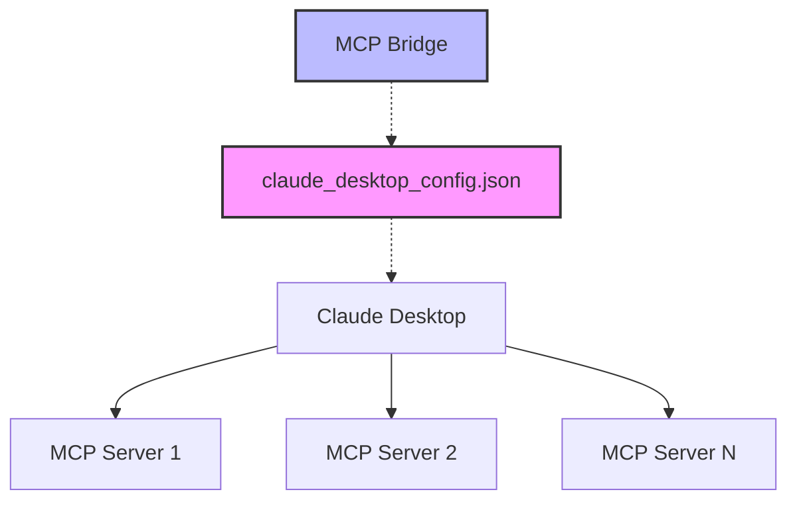
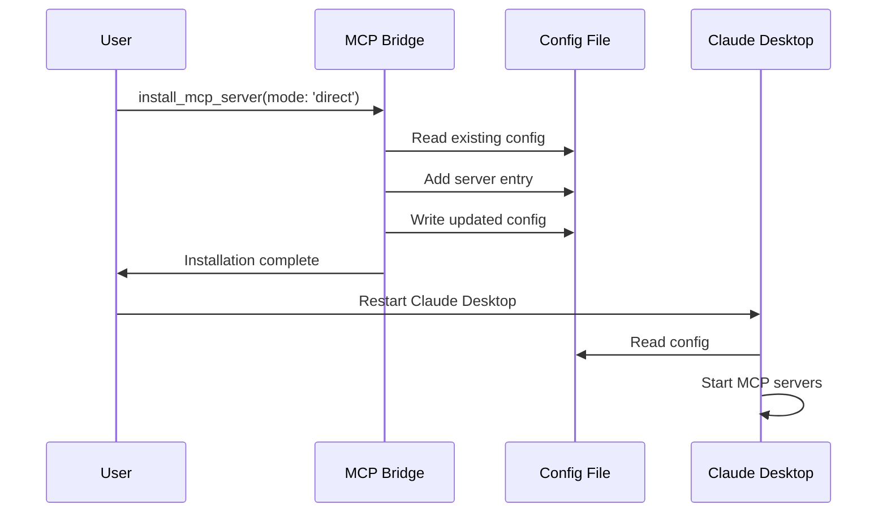

# 📝 Direct Mode Guide

Direct mode provides **static configuration management** by modifying Claude Desktop's configuration file directly, similar to Smithery. This guide covers everything you need to know about using direct mode effectively.

## 🎯 What is Direct Mode?

Direct mode is a **static configuration approach** where the MCP Bridge modifies Claude Desktop's `claude_desktop_config.json` file to add MCP servers. This provides permanent installations with direct connections and native tool names.

### **Key Characteristics**

- ✅ **Permanent Installation**: Survives restarts and bridge shutdowns
- ✅ **Direct Performance**: No proxy overhead, native speed
- ✅ **Native Tool Names**: Tools keep their original names (no prefixes)
- ✅ **Smithery Compatible**: Same configuration format
- ✅ **Production Ready**: Stable, long-term deployments

## 🚀 Getting Started

### **Basic Installation**

```javascript
// Install an NPM package server
await callTool('install_mcp_server', {
  name: 'filesystem',
  type: 'npm',
  command: '@modelcontextprotocol/server-filesystem',
  mode: 'direct'
});

// Result: Claude Desktop config updated
// Action required: Restart Claude Desktop
// Tools available after restart: read_file, write_file (no prefix)
```

### **Docker Server Installation**

```javascript
// Install a Docker-based server
await callTool('install_mcp_server', {
  name: 'gmail',
  type: 'docker',
  command: 'docker run -i mcplookup/gmail-server:latest',
  mode: 'direct',
  env: {
    'GMAIL_API_KEY': 'your-api-key'
  }
});

// Result: Claude Desktop config updated with Docker command
```

## 🏗️ How Direct Mode Works

### **Architecture Overview**



### **Installation Process**

1. **Config Location**: Bridge finds Claude Desktop config file
2. **Config Reading**: Reads existing configuration
3. **Server Addition**: Adds new server entry
4. **Config Writing**: Writes updated configuration
5. **User Action**: User must restart Claude Desktop
6. **Direct Connection**: Claude connects directly to servers

### **Configuration File Structure**

Direct mode creates entries in `claude_desktop_config.json`:

```json
{
  "mcpServers": {
    "filesystem": {
      "command": "npx",
      "args": ["@modelcontextprotocol/server-filesystem"],
      "env": {
        "ALLOWED_DIRS": "/home/user/documents"
      }
    },
    "gmail": {
      "command": "docker",
      "args": ["run", "-i", "mcplookup/gmail-server:latest"],
      "env": {
        "GMAIL_API_KEY": "your-api-key"
      }
    }
  }
}
```

## 📁 Configuration Management

### **Config File Locations**

The bridge automatically detects Claude Desktop config in these locations:

#### **macOS**
```
~/Library/Application Support/Claude/claude_desktop_config.json
```

#### **Windows**
```
%APPDATA%/Claude/claude_desktop_config.json
```

#### **Linux**
```
~/.config/Claude/claude_desktop_config.json
```

### **Viewing Current Configuration**

```javascript
// List all servers in Claude Desktop config
await callTool('list_claude_servers');

// Response shows all configured servers
[
  {
    name: 'filesystem',
    command: 'npx',
    args: ['@modelcontextprotocol/server-filesystem'],
    env: {
      'ALLOWED_DIRS': '/home/user/documents'
    },
    mode: 'direct'
  }
]
```

### **Removing Servers**

```javascript
// Remove a server from Claude Desktop config
await callTool('remove_claude_server', {
  name: 'filesystem'
});

// Result: Server removed from config
// Action required: Restart Claude Desktop
```

## 🔧 Server Types & Commands

### **NPM Package Servers**

#### **Basic NPM Installation**

```javascript
await callTool('install_mcp_server', {
  name: 'filesystem',
  type: 'npm',
  command: '@modelcontextprotocol/server-filesystem',
  mode: 'direct'
});
```

**Generated Config:**
```json
{
  "filesystem": {
    "command": "npx",
    "args": ["@modelcontextprotocol/server-filesystem"]
  }
}
```

#### **NPM with Environment Variables**

```javascript
await callTool('install_mcp_server', {
  name: 'database',
  type: 'npm',
  command: '@company/database-server',
  mode: 'direct',
  env: {
    'DATABASE_URL': 'postgresql://localhost:5432/mydb',
    'POOL_SIZE': '10'
  }
});
```

**Generated Config:**
```json
{
  "database": {
    "command": "npx",
    "args": ["@company/database-server"],
    "env": {
      "DATABASE_URL": "postgresql://localhost:5432/mydb",
      "POOL_SIZE": "10"
    }
  }
}
```

### **Docker Servers**

#### **Basic Docker Installation**

```javascript
await callTool('install_mcp_server', {
  name: 'api-server',
  type: 'docker',
  command: 'docker run -i company/api-server:latest',
  mode: 'direct'
});
```

**Generated Config:**
```json
{
  "api-server": {
    "command": "docker",
    "args": ["run", "-i", "company/api-server:latest"]
  }
}
```

#### **Docker with Environment Variables**

```javascript
await callTool('install_mcp_server', {
  name: 'secure-api',
  type: 'docker',
  command: 'docker run -i secure/api-server:v1.0',
  mode: 'direct',
  env: {
    'API_KEY': 'your-secret-key',
    'ENVIRONMENT': 'production'
  }
});
```

**Generated Config:**
```json
{
  "secure-api": {
    "command": "docker",
    "args": ["run", "-i", "secure/api-server:v1.0"],
    "env": {
      "API_KEY": "your-secret-key",
      "ENVIRONMENT": "production"
    }
  }
}
```

## 🛠️ Tool Usage

### **Native Tool Names**

Direct mode preserves original tool names:

| Server | Tools Available |
|--------|----------------|
| filesystem | read_file, write_file, list_directory |
| gmail | send_email, read_inbox, search_emails |
| database | query, insert, update, delete |

### **Using Direct Mode Tools**

```javascript
// Filesystem tools (no prefix)
await callTool('read_file', {
  path: '/documents/report.txt'
});

await callTool('write_file', {
  path: '/documents/output.txt',
  content: 'Generated content'
});

// Gmail tools (no prefix)
await callTool('send_email', {
  to: 'user@example.com',
  subject: 'Direct Mode Email',
  body: 'This email was sent via direct mode!'
});

// Database tools (no prefix)
await callTool('query', {
  sql: 'SELECT * FROM users WHERE active = true'
});
```

## 🔄 Lifecycle Management

### **Installation Workflow**



### **Complete Management Workflow**

```javascript
// 1. Install server
await callTool('install_mcp_server', {
  name: 'production-server',
  type: 'npm',
  command: '@company/production-server',
  mode: 'direct',
  env: {
    'ENVIRONMENT': 'production',
    'API_KEY': 'prod-key'
  }
});

// 2. Check configuration
await callTool('list_claude_servers');

// 3. Restart Claude Desktop manually
// (Required step - cannot be automated)

// 4. Use server tools (after restart)
await callTool('production_function', {
  data: 'important-data'
});

// 5. Remove when no longer needed
await callTool('remove_claude_server', {
  name: 'production-server'
});

// 6. Restart Claude Desktop again
// (Required to remove the server)
```

## 🔒 Security Considerations

### **Environment Variable Security**

#### **✅ Best Practices**

```javascript
// Use environment variables from the system
await callTool('install_mcp_server', {
  name: 'secure-server',
  type: 'npm',
  command: '@company/secure-server',
  mode: 'direct',
  env: {
    'API_KEY': process.env.PRODUCTION_API_KEY,
    'DATABASE_URL': process.env.DATABASE_URL
  }
});
```

#### **❌ Avoid**

```javascript
// Don't hardcode secrets in the bridge calls
await callTool('install_mcp_server', {
  name: 'insecure-server',
  type: 'npm',
  command: '@company/server',
  mode: 'direct',
  env: {
    'API_KEY': 'hardcoded-secret-key'  // ❌ Bad!
  }
});
```

### **Config File Permissions**

Ensure proper permissions on the config file:

```bash
# macOS/Linux
chmod 600 ~/Library/Application\ Support/Claude/claude_desktop_config.json

# Check permissions
ls -la ~/Library/Application\ Support/Claude/claude_desktop_config.json
```

### **Docker Security**

```javascript
// Use specific image tags, not 'latest'
await callTool('install_mcp_server', {
  name: 'secure-docker',
  type: 'docker',
  command: 'docker run -i company/server:v1.2.3',  // ✅ Specific version
  mode: 'direct'
});

// Add security options to Docker command
await callTool('install_mcp_server', {
  name: 'hardened-server',
  type: 'docker',
  command: 'docker run -i --read-only --no-new-privileges company/server:v1.0',
  mode: 'direct'
});
```

## 🎯 Use Cases

### **1. Production Deployments**

```javascript
// Core production servers
const productionServers = [
  {
    name: 'filesystem',
    command: '@modelcontextprotocol/server-filesystem',
    env: { 'ALLOWED_DIRS': '/app/data' }
  },
  {
    name: 'database',
    command: '@company/database-server',
    env: { 'DATABASE_URL': process.env.PROD_DB_URL }
  },
  {
    name: 'email',
    command: '@company/email-server',
    env: { 'SMTP_HOST': process.env.SMTP_HOST }
  }
];

for (const server of productionServers) {
  await callTool('install_mcp_server', {
    name: server.name,
    type: 'npm',
    command: server.command,
    mode: 'direct',
    env: server.env
  });
}

// Restart Claude Desktop once for all servers
```

### **2. Stable Development Environment**

```javascript
// Development environment setup
await callTool('install_mcp_server', {
  name: 'dev-filesystem',
  type: 'npm',
  command: '@modelcontextprotocol/server-filesystem',
  mode: 'direct',
  env: {
    'ALLOWED_DIRS': '/home/developer/projects'
  }
});

await callTool('install_mcp_server', {
  name: 'dev-database',
  type: 'docker',
  command: 'docker run -i postgres-mcp:dev',
  mode: 'direct',
  env: {
    'DATABASE_URL': 'postgresql://localhost:5432/devdb'
  }
});
```

### **3. Team Standardization**

```javascript
// Standard team configuration
const teamConfig = {
  servers: [
    {
      name: 'team-filesystem',
      type: 'npm',
      command: '@company/filesystem-server',
      env: { 'TEAM_ROOT': '/shared/team' }
    },
    {
      name: 'team-jira',
      type: 'npm',
      command: '@company/jira-server',
      env: { 'JIRA_URL': 'https://company.atlassian.net' }
    }
  ]
};

// Deploy team configuration
for (const server of teamConfig.servers) {
  await callTool('install_mcp_server', {
    ...server,
    mode: 'direct'
  });
}
```

### **4. Migration from Smithery**

```javascript
// Migrate existing Smithery installations
const smitheryServers = [
  '@wonderwhy-er/desktop-commander',
  '@modelcontextprotocol/server-filesystem',
  '@company/custom-server'
];

for (const packageName of smitheryServers) {
  const serverName = packageName.replace(/[@\/]/g, '-');
  
  await callTool('install_mcp_server', {
    name: serverName,
    type: 'npm',
    command: packageName,
    mode: 'direct'
  });
}
```

## 🚀 Performance Optimization

### **Direct Connection Benefits**

- **No Proxy Overhead**: Direct stdio communication
- **Native Speed**: Full performance of the MCP protocol
- **Lower Memory**: No bridge process management
- **Reduced Latency**: One less network hop

### **Performance Monitoring**

```javascript
// Monitor tool performance
const performanceTracker = {
  startTime: Date.now(),
  toolCalls: 0
};

// Wrapper for performance tracking
async function timedToolCall(toolName, args) {
  const start = Date.now();
  const result = await callTool(toolName, args);
  const duration = Date.now() - start;
  
  performanceTracker.toolCalls++;
  console.log(`${toolName}: ${duration}ms`);
  
  return result;
}

// Use with direct mode tools
await timedToolCall('read_file', { path: '/large-file.txt' });
```

## 🔄 Migration Strategies

### **Bridge → Direct Migration**

```javascript
// 1. Test server in bridge mode first
await callTool('install_mcp_server', {
  name: 'test-server',
  type: 'npm',
  command: '@company/new-server',
  mode: 'bridge'
});

// 2. Test thoroughly
await callTool('test-server_function', { test: 'data' });

// 3. If satisfied, remove from bridge
await callTool('control_mcp_server', {
  name: 'test-server',
  action: 'remove'
});

// 4. Install in direct mode
await callTool('install_mcp_server', {
  name: 'production-server',
  type: 'npm',
  command: '@company/new-server',
  mode: 'direct'
});

// 5. Restart Claude Desktop
```

### **Smithery → Direct Mode Migration**

```javascript
// 1. List current Smithery installations
// (Check claude_desktop_config.json manually)

// 2. Remove old entries
await callTool('remove_claude_server', {
  name: 'old-smithery-server'
});

// 3. Install via bridge
await callTool('install_mcp_server', {
  name: 'new-server-name',
  type: 'npm',
  command: '@same/package-name',
  mode: 'direct'
});
```

## 🚨 Troubleshooting

### **Common Issues**

#### **Config File Not Found**

```javascript
// Check if config file exists
await callTool('list_claude_servers');

// If error: "Config file not found"
// Create the file manually or via Claude Desktop settings
```

#### **Permission Denied**

```bash
# Fix config file permissions
chmod 644 ~/Library/Application\ Support/Claude/claude_desktop_config.json

# Check directory permissions
ls -la ~/Library/Application\ Support/Claude/
```

#### **Server Not Starting After Restart**

```javascript
// Check server configuration
await callTool('list_claude_servers');

// Verify the command and arguments are correct
// Check environment variables are set properly
```

#### **Tools Not Available**

1. **Verify restart**: Ensure Claude Desktop was restarted
2. **Check config**: Use `list_claude_servers` to verify installation
3. **Check logs**: Look at Claude Desktop logs for errors
4. **Test manually**: Try running the server command manually

### **Config File Validation**

```javascript
// Validate config after installation
await callTool('list_claude_servers');

// Expected response should show your server
// If empty or error, check config file manually
```

### **Manual Config Inspection**

```bash
# View current config (macOS)
cat ~/Library/Application\ Support/Claude/claude_desktop_config.json

# Pretty print JSON
cat ~/Library/Application\ Support/Claude/claude_desktop_config.json | jq .
```

## 📊 Monitoring & Maintenance

### **Regular Health Checks**

```javascript
// Weekly config review
async function reviewConfig() {
  const servers = await callTool('list_claude_servers');
  
  console.log(`Total servers: ${servers.length}`);
  
  for (const server of servers) {
    console.log(`- ${server.name}: ${server.command} ${server.args.join(' ')}`);
  }
}

// Run monthly
setInterval(reviewConfig, 30 * 24 * 60 * 60 * 1000);
```

### **Config Backup**

```bash
# Backup config file
cp ~/Library/Application\ Support/Claude/claude_desktop_config.json \
   ~/claude_config_backup_$(date +%Y%m%d).json

# Restore from backup
cp ~/claude_config_backup_20240115.json \
   ~/Library/Application\ Support/Claude/claude_desktop_config.json
```

---

**Next Steps:**
- [🔧 Bridge Mode Guide](./bridge-mode.md)
- [🔄 Hybrid Workflows](./hybrid-workflows.md)
- [📋 API Reference](../api/)
